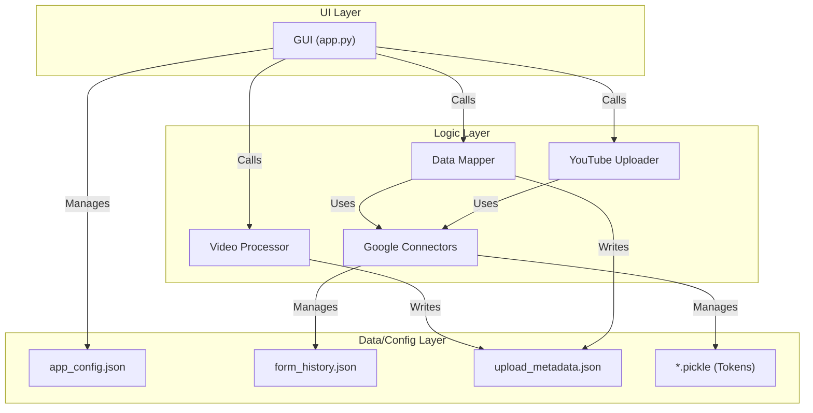
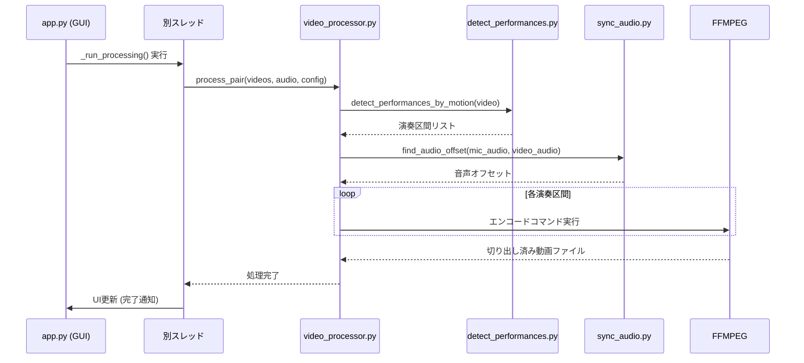
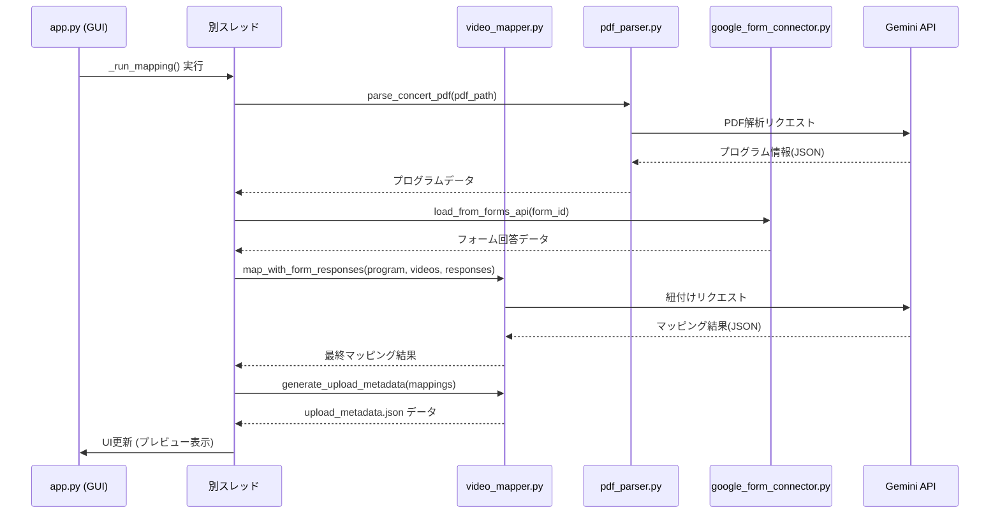

# CVCutter 開発者向けマニュアル

## 1. はじめに
このドキュメントは、CVCutterの内部アーキテクチャ、主要な処理フロー、および各モジュールの役割について解説する開発者向けのマニュアルです。

## 2. プロジェクト構成
プロジェクトは主に以下の要素で構成されています。

-   **`src/cvcutter/`**: アプリケーションのコアロジックを含むメインのソースディレクトリ。
-   **`run_app.py`**: アプリケーションを起動するためのエントリーポイント。
-   **`build_exe.py`**: `PyInstaller` を使用して実行可能ファイル（`.exe`）をビルドするためのスクリプト。
-   **`requirements.txt`**: Pythonの依存関係リスト。
-   **`docs/`**: 本マニュアルを含むドキュメントディレクトリ。

## 3. アーキテクチャ概要
CVCutterは、UI層、ロジック層、データ永続化層に大別できます。



-   **UI Layer**: `customtkinter`で構築されたGUI。ユーザーからの入力を受け付け、ロジック層の機能を呼び出します。
-   **Logic Layer**: 動画処理、データマッピング、アップロードといった中核機能を担うモジュール群です。
-   **Data/Config Layer**: アプリケーションの設定、認証トークン、処理途中のメタデータなどをファイルとして管理します。

## 4. 主要モジュール解説
-   **`app.py`**:
    -   アプリケーションのメインウィンドウとUI全体のレイアウトを構築。
    -   各タブのUI要素（ボタン、入力欄など）を定義。
    -   ユーザー操作をトリガーとして、バックグラウンドのスレッドで各処理（動画処理、マッピング等）を実行するイベントハンドラを実装。

-   **`video_processor.py`**:
    -   `detect_performances_by_motion`を呼び出して演奏区間を特定。
    -   `sync_audio.py`を呼び出して音声のオフセットを計算。
    -   `ffmpeg`をサブプロセスとして実行し、動画の切り出し、音声ミックス、エンコードを行う。

-   **`detect_performances.py`**:
    -   OpenCVの背景差分法（`createBackgroundSubtractorMOG2`）を用いて前景（動体）を検出。
    -   `CentroidTracker`クラスで動体の追跡を行い、舞台への「入場」と「退場」を判定して演奏区間（開始時間、終了時間）をリストアップする。

-   **`video_mapper.py`**:
    -   `pdf_parser.py`でPDFからプログラム情報を抽出。
    -   `google_form_connector.py`でフォーム回答を取得。
    -   切り出された動画ファイルリストと上記2つの情報を、順序やGemini APIによる意味解釈を元に統合（マッピング）する。
    -   最終的なアップロード用メタデータ（`upload_metadata.json`）を生成する。

-   **`youtube_uploader.py`**:
    -   `upload_metadata.json`を読み込み、リストされた動画を順次アップロード。
    -   `QuotaManager`クラスでYouTube Data APIのクォータを管理。上限に達した場合は、リセット時刻まで自動で待機する。

-   **`config_manager.py`**:
    -   `app_config.json`の読み書きを管理し、アプリケーション全体で設定値を共有するためのシングルトン的な役割を担う。

## 5. 主要な処理フロー
### 5.1. 動画処理フロー (`_run_processing`)


### 5.2. データマッピングフロー (`_run_mapping`)


## 6. ビルド方法
このプロジェクトは`PyInstaller`を使用してシングルバイナリの実行可能ファイルにバンドルされます。

1.  **依存関係のインストール**:
    ```bash
    uv pip install -r requirements.txt
    ```
2.  **ビルドの実行**:
    リポジトリのルートで以下のコマンドを実行します。
    ```bash
    uv run build_exe.py
    ```
    これにより、`dist`ディレクトリ内に`CVCutter.exe`が生成されます。`build_exe.py`スクリプトは、アイコンの指定や必要なデータファイル（`favicon.ico`など）のバンドル設定を含んでいます。
