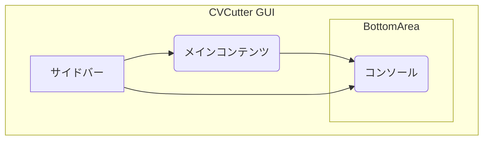
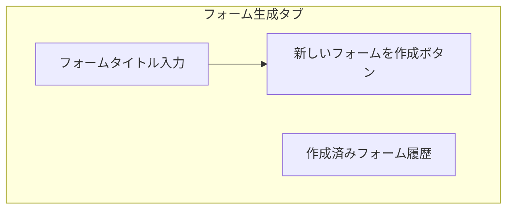
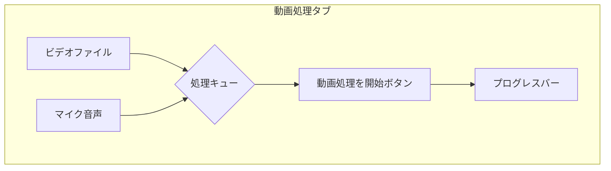
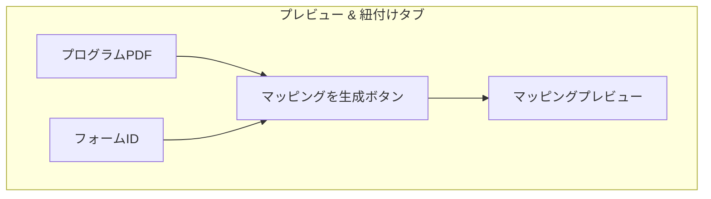
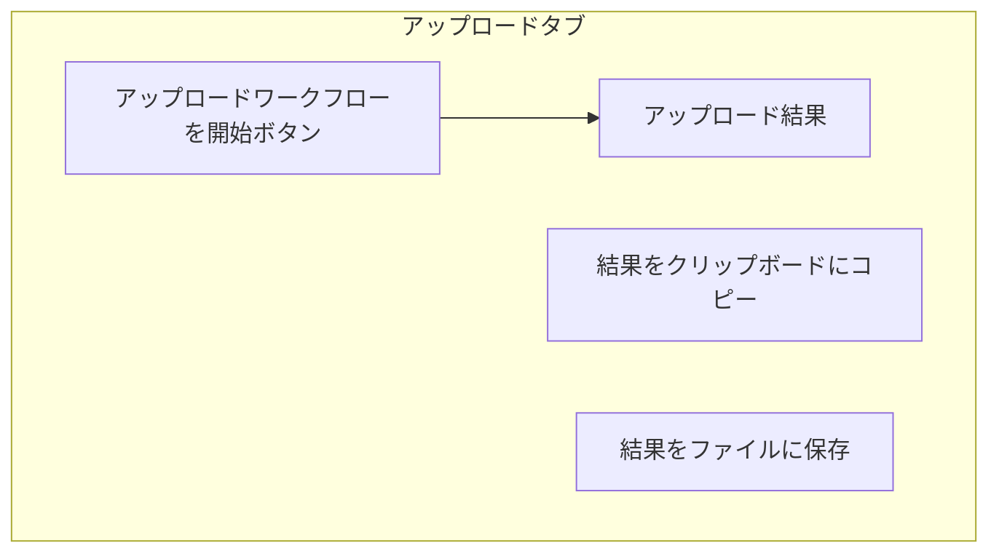
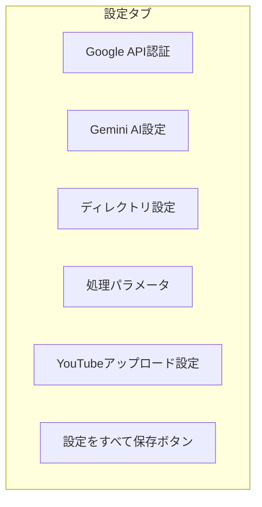

# CVCutter ユーザーマニュアル

## 1. はじめに

### CVCutterへようこそ
CVCutterは、コンサートの長時間録画から各演奏を自動で切り出し、外部マイク音声との合成、PDFプログラムとアンケート回答に基づくタイトル付け、そしてYouTubeへの自動投稿までを一気通貫で行うツールです。

このマニュアルでは、CVCutterを初めて利用する方向けに、基本的な設定から操作フローまでを解説します。

### このマニュアルの対象読者
- コンサートの録画映像を効率的に編集・公開したい方
- PCの基本的な操作に慣れている方
- Googleアカウントをお持ちの方

---

## 2. 【最重要】事前準備
CVCutterの全機能を利用するには、いくつかのAPIキーの準備が必要です。

### 2.1. Google Cloud Platform (GCP) の設定
YouTubeへの自動投稿やGoogleフォームとの連携には、Google Cloudでの「認証情報」の作成が必要です。

#### A. プロジェクトの作成とAPIの有効化
1.  [Google Cloud Console](https://console.cloud.google.com/) にアクセスし、新しいプロジェクトを作成します。
2.  左メニューの「APIとサービス」 > 「ライブラリ」を開き、以下の2つを検索して「有効化」してください。
    *   `YouTube Data API v3`
    *   `Google Forms API`

#### B. OAuth同意画面の設定
1.  「APIとサービス」 > 「OAuth同意画面」を開きます。
2.  ユーザータイプで「外部」を選択し「作成」を押します。
3.  アプリ名（例: CVCutter）やユーザーサポートメール等の必須項目を入力して保存します。
4.  スコープの設定：
    *   「スコープを追加または削除」から、以下の3つを検索して追加してください。
    *   `https://www.googleapis.com/auth/forms.body` (フォーム作成用)
    *   `https://www.googleapis.com/auth/forms.responses.readonly` (回答取得用)
    *   `https://www.googleapis.com/auth/youtube.upload` (YouTubeアップロード用)
5.  **【最重要】**「テストユーザー」セクションで、ご自身のGoogleアカウント（Gmailアドレス）を必ず追加してください。

#### C. 認証情報の作成
1.  「APIとサービス」 > 「認証情報」を開きます。
2.  「認証情報を作成」 > 「OAuth クライアントID」を選択します。
3.  アプリケーションの種類で「デスクトップアプリ」を選択します。
4.  名前は任意（例: CVCutter Client）で作成します。
5.  作成後、リストの右側にある「JSONをダウンロード」ボタン（↓）を押し、`client_secrets.json`という名前で保存します。
6.  **保存した`client_secrets.json`を、CVCutterの実行ファイル（`.exe`）と同じフォルダに配置してください。**

### 2.2. Gemini AI の設定
PDFプログラムの読み取りや、演奏情報とアンケートの高度な紐付けにAIを使用します。

1.  [Google AI Studio](https://aistudio.google.com/app/apikey) にアクセスします。
2.  「Create API key」をクリックしてAPIキーを発行し、コピーします。
3.  後ほど、CVCutterアプリの「設定」タブにある「Gemini API Key」欄にこのキーを貼り付けます。

---

## 3. アプリケーションの画面構成
CVCutterの画面は、大きく分けて「サイドバー」「メインコンテンツ」「コンソール」の3つのエリアで構成されています。

- **サイドバー**: 各機能へアクセスするためのナビゲーションメニューです。
- **メインコンテンツ**: サイドバーで選択した機能の操作パネルが表示されます。
- **コンソール**: アプリケーションの動作ログやエラーメッセージが表示されます。何か問題が発生した場合は、まずこのエリアを確認してください。

---

## 4. 基本的な操作フロー
事前準備が完了したら、以下の流れで操作を進めます。

### ステップ1: アプリ内設定と認証
1.  CVCutterを起動し、「設定」タブを開きます。
2.  **Google API認証**:
    *   「Client Secrets JSON」の欄に、準備段階で配置した`client_secrets.json`のパスが正しく表示されていることを確認します。
    *   「Googleフォーム認証」と「YouTubeアップロード認証」のボタンをそれぞれクリックし、ブラウザで表示される指示に従ってアカウントの認証を完了させます。
3.  **Gemini AI設定**:
    *   「Gemini API Key」の欄に、準備段階で取得したAPIキーを貼り付けます。
    *   「APIキーを検証」ボタンを押し、「成功」と表示されることを確認します。
4.  「設定をすべて保存」ボタンをクリックします。

### ステップ2: フォーム生成
1.  「0. フォーム生成」タブを開きます。
2.  「新しいフォームを作成」ボタンをクリックすると、演奏者に回答してもらうためのGoogleフォームが自動で作成されます。
3.  作成後、コンソールに表示される「回答用URL」をコピーし、演奏者に配布してください。

### ステップ3: 動画処理
1.  「1. 動画処理」タブを開きます。
2.  「ビデオを追加」ボタンから、カメラで撮影した動画ファイル（複数可）を選択します。（※動画ファイル名は、時系列順とファイル名順が同一になるように変更してください。紐づけができなくなります。）
3.  外部マイクで別途録音した音声がある場合は、「音声を追加」ボタンから選択します。
4.  「選択項目をキューに追加」ボタンで、処理したいビデオと音声の組み合わせを決定します。
（追記：例えば、演奏が01.mp4と02.mp4に分割されている場合、同一キューに入れてください。また、音声ファイルの内容が複数の動画ファイルとかぶる場合も同一キューに入れてください。
※同一キューに入れすぎないでください。分割できる場合は別々のキューに入れてください。メモリ不足防止の為。）
5.  「動画処理を開始」ボタンをクリックすると、演奏区間の切り出しと音声の同期が自動で行われます。処理には時間がかかります。

### ステップ4: プレビュー & 紐付け
1.  「2. プレビュー & 紐付け」タブを開きます。
2.  「プログラムPDF」に、演奏会のプログラムが記載されたPDFファイルを選択します。
3.  「フォームID」に、ステップ2で作成したGoogleフォームのIDを入力します。（フォーム編集画面のURL `https://docs.google.com/forms/d/【ここがフォームID】/edit` の部分です）
4.  「マッピングを生成」ボタンをクリックします。AIがPDFとフォーム回答を解析し、どの動画が誰の演奏かを自動で紐付けます。
5.  プレビューエリアに表示された紐付け結果を確認し、必要であれば手動で修正します。

### ステップ5: アップロード
1.  「3. アップロード」タブを開きます。
2.  「アップロードワークフローを開始」ボタンをクリックします。
3.  紐付け結果に基づいて、動画のタイトルや説明文が自動で設定され、YouTubeへのアップロードが順次開始されます。（制約上、一日最大6本までアップロードできます。上限が来たら自動で24時間待機します。）
4.  アップロードが完了すると、結果エリアに各動画のURLが表示されます。コピペするかエクスポートしたファイルを演奏者に提供しましょう。

---

## 5. 各機能の詳細

### 5.1. フォーム生成 (0. フォーム生成)

- **機能概要**: 演奏者に配布するGoogleフォームを自動で作成します。
- **フォームタイトル**: 作成するフォームのタイトルを指定します。
- **新しいフォームを作成ボタン**: Google Forms APIと連携し、必要な質問項目が設定されたフォームを生成します。
- **作成済みフォーム履歴**: 過去に作成したフォームの情報を表示します。

### 5.2. 動画処理 (1. 動画処理)

- **機能概要**: 演奏区間の自動検出、音声同期、動画の切り出しを行います。
- **ビデオファイル**: カメラで撮影した動画ファイルを追加します。
- **マイク音声**: 外部マイクで録音した音声ファイルを追加します。
- **処理キュー**: 処理対象のビデオと音声の組み合わせをリスト化します。
- **動画処理を開始ボタン**: キューに追加されたファイルを元に、一括で処理を開始します。

### 5.3. プレビュー & 紐付け (2. プレビュー & 紐付け)

- **機能概要**: PDFプログラム、フォーム回答、処理済み動画をAIを用いて紐付けます。
- **プログラムPDF**: コンサートのプログラムが記載されたPDFファイルを選択します。
- **フォームID**: 回答を収集したGoogleフォームのIDを入力します。
- **マッピングを生成ボタン**: 上記の情報を元に、どの動画が誰のどの演奏かを自動で解析・紐付けします。
- **マッピングプレビュー**: 紐付け結果を一覧で表示・確認します。

### 5.4. アップロード (3. アップロード)

- **機能概要**: 紐付け結果に基づき、YouTubeへ動画を自動でアップロードします。
- **アップロードワークフローを開始ボタン**: タイトルや説明文を自動生成し、アップロード処理を開始します。
- **アップロード結果**: アップロードされた動画のURLや公開設定などを表示します。

### 5.5. 設定
アプリケーションの動作をカスタマイズするための詳細な設定項目です。

-   **Google API認証**:
    -   `Client Secrets JSON`: 事前準備で取得した `client_secrets.json` ファイルのパスを指定します。「参照」ボタンから選択できます。
    -   `Googleフォーム認証`: フォームの作成や回答取得に必要な認証を行います。クリックするとブラウザが開き、アカウントの許可を求められます。
    -   `YouTubeアップロード認証`: 動画のアップロードに必要な認証を行います。同様にブラウザで許可を与えます。

-   **Gemini AI設定**:
    -   `AI紐付けを使用`: PDF解析やフォーム回答との高度な紐付けにGemini AIを使用するかどうかのスイッチです。
    -   `Gemini API Key`: 事前準備で取得したAPIキーを貼り付けます。
    -   `Geminiモデル`: 使用するAIのモデルを選択します。通常はデフォルトの`gemini-2.5-flash`で問題ありませんが、より高精度なモデルを選択することも可能です（性能に応じて料金が変わる可能性があります）。
    -   `APIキーを検証`: 入力したAPIキーが有効かを確認します。

-   **ディレクトリ設定**:
    -   `出力ディレクトリ`: 演奏区間を切り出した動画ファイルが保存される場所です。
    -   `一時ディレクトリ`: 動画処理中に使用される一時ファイルが保存される場所です。

-   **処理パラメータ**:
    -   `ビデオ音量`: 最終的な動画に含まれる、元のビデオの音量を調整します（0〜1.0）。
    -   `マイク音量`: 外部マイクの音量を調整します。1.0以上を設定すると音量を増幅できます。
    -   `最小演奏時間（秒）`: これより短い時間は演奏として認識されず、切り出しの対象外となります。ノイズによる誤検出を防ぎます。
    -   `GPUアクセラレーション`: NVIDIA製のGPUが搭載されている場合、このチェックを入れることで動画のエンコード処理を高速化できます。

-   **YouTubeアップロード設定**:
    -   `アップロード チャンクサイズ (MB)`: 一度にアップロードするデータのサイズです。ネットワークが不安定な場合は、この値を小さく（5MBなど）すると成功率が上がることがあります。

-   **設定をすべて保存ボタン**:
    -   このタブで行ったすべての変更を `app_config.json` ファイルに保存します。設定を変更した後は必ずクリックしてください。
